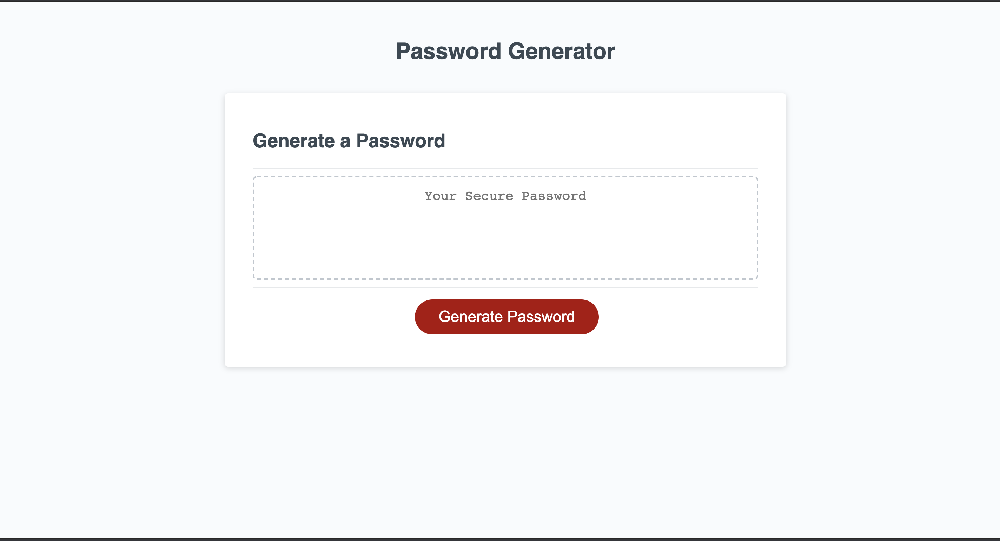

In this assignment I was challenged to create a password generator. This was by far the most difficult assignment I had to complete so far. Javascript has been a challenge to understand, however I was more than thrilled when my password generator worked properly.  My motivation for this assignment was to embrace the challenge of using Javascript to complete my password generator. I learned how to better understand certain tools for Javascript such as APIs and and arrays.

[Link to deployed webpage](https://temifemi.github.io/PasswordGenerator/)

## Screenshot of Portfolio Website 
